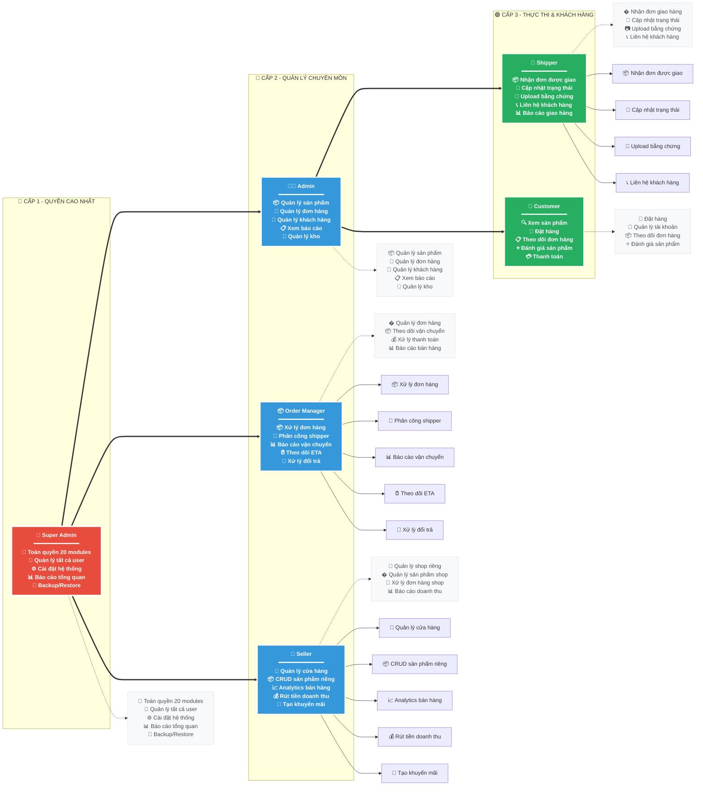
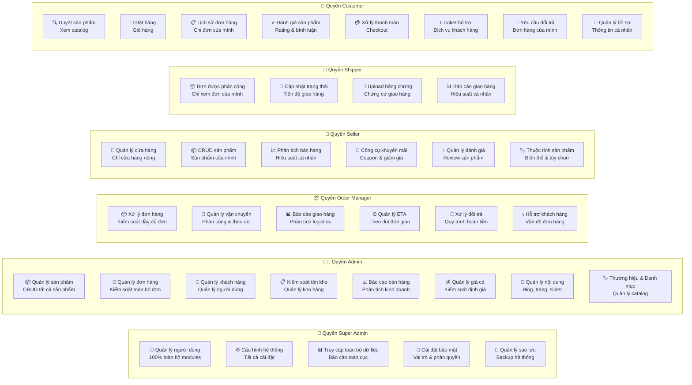
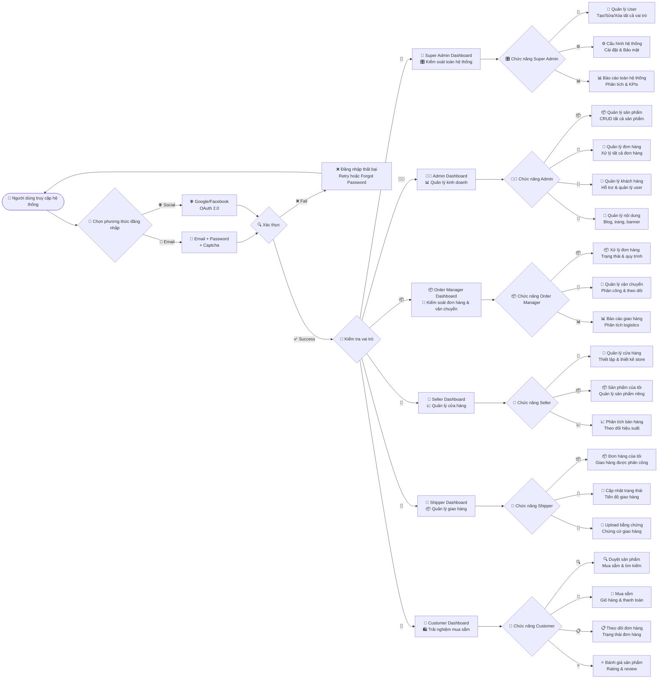
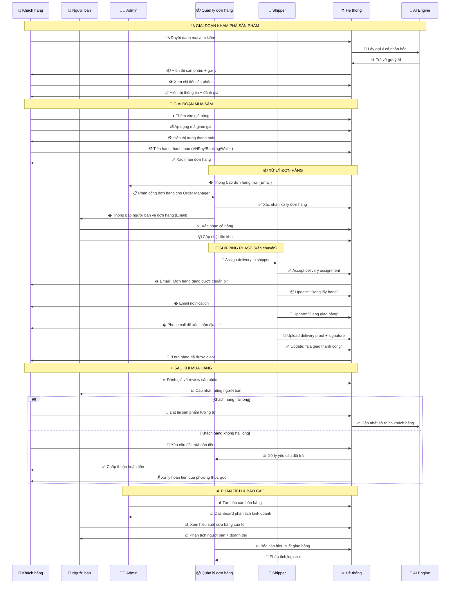
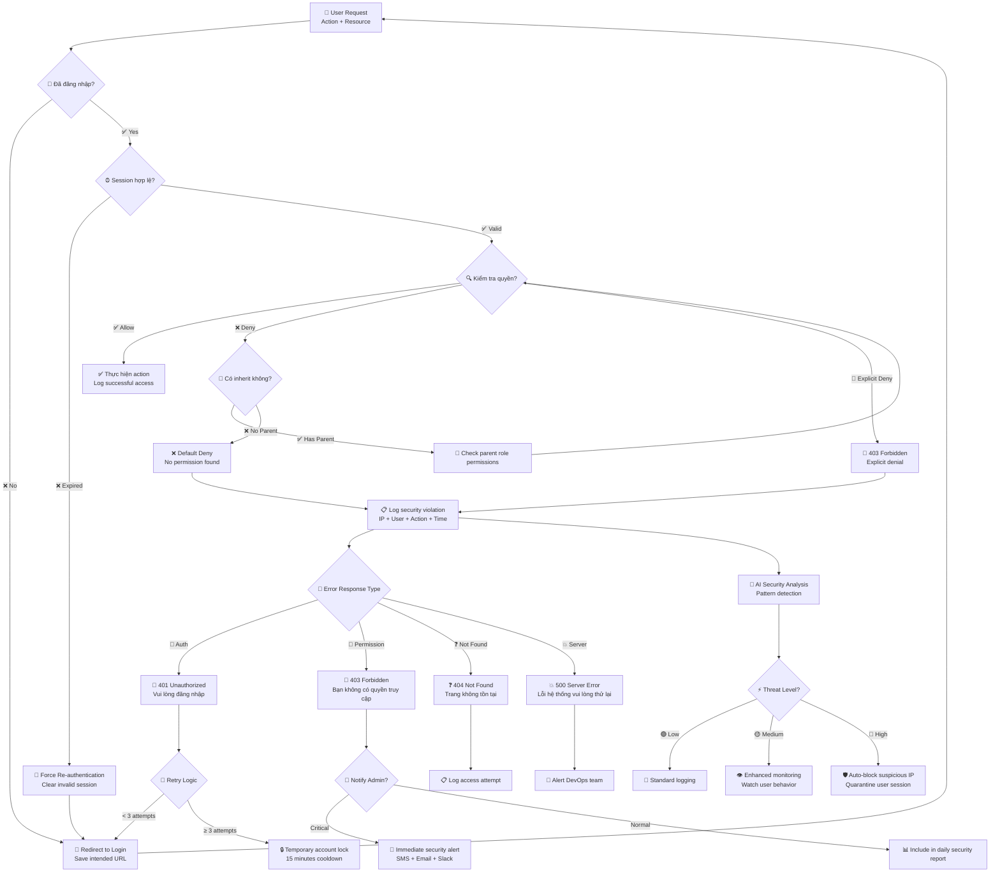
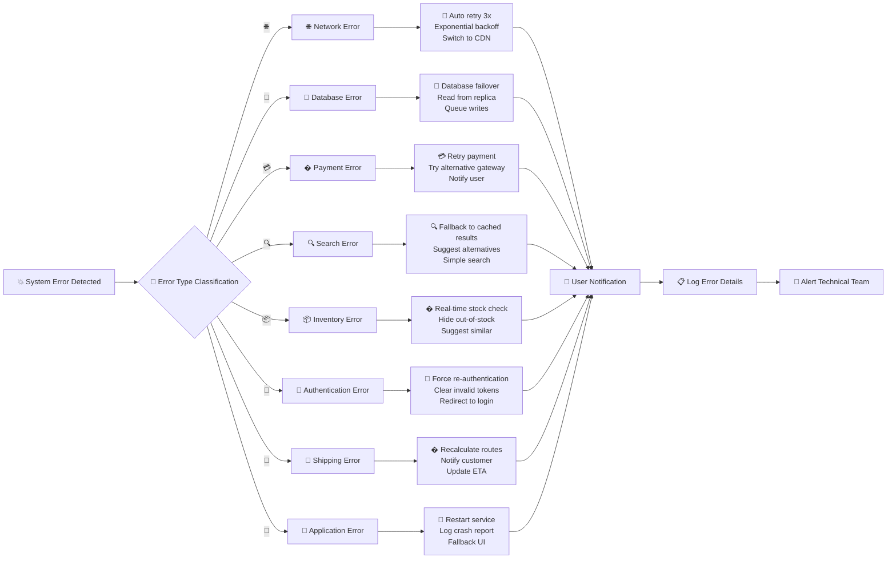
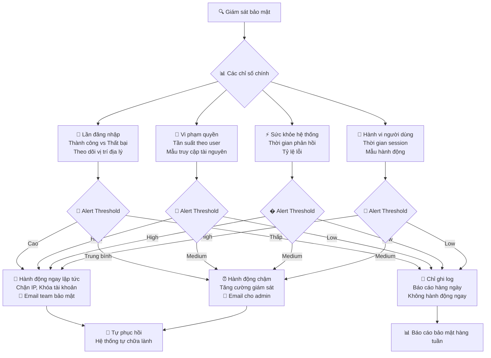
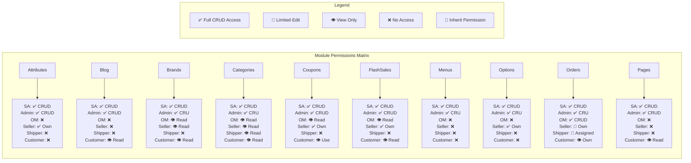

# Hệ Thống Phân Quyền và Luồng Người Dùng cho Sàn Thương Mại Điện Tử

## Tổng Quan Dự Án
**Mục Tiêu Chính**: Xây dựng website bán hàng và ứng dụng di động toàn diện với giao diện hiện đại, bắt mắt và thân thiện với người dùng.

**Vấn Đề Cần Giải Quyết**: Cung cấp trải nghiệm mua sắm tiện lợi cho khách hàng không muốn ra ngoài do thời tiết, bận công việc hoặc các lý do khác.

**Đối Tượng Người Dùng**: Giới trẻ độ tuổi 18-40 và những người có nhu cầu sử dụng dịch vụ.

## Phạm Vi Hệ Thống
- **Giới Hạn Địa Lý**: Cấp tỉnh với chia nhỏ theo Phường/Xã
- **Khu Vực Bán Hàng**: Phạm vi bán hàng có giới hạn cho từng sản phẩm
- **Giao Diện Tham Khảo**: Đăng ký kiểu Shopee, hiển thị kiểu Homfam
- **Danh Mục Sản Phẩm**: Hàng thiết yếu gia dụng + món ăn đã nấu sẵn
- **Chiến Lược Đăng Ký**: Đăng ký ban đầu đơn giản với ít thông tin, yêu cầu bổ sung khi người dùng cần tính năng nâng cao

## Các Vai Trò
- **Super Admin (Admin Tổng)**: Quyền truy cập toàn hệ thống, quản lý tất cả người dùng, vai trò và phân quyền.
- **Admin (Người nhập hàng)**: Quản lý kho hàng, khách hàng, shipper và đơn hàng.
- **Người Bán/Chủ Cửa Hàng**: Quản lý cửa hàng riêng, sản phẩm và đơn hàng của mình, chuyên biệt cho các hoạt động quản lý đơn hàng.
- **Admin Shipper**: Quản lý các shipper, quản lý các đơn giao hàng được phân công, cập nhật trạng thái giao hàng, tải lên bằng chứng và báo cáo giao hàng.
- **Khách Hàng (Người mua)**: Truy cập các tính năng phía khách hàng, đặt hàng, theo dõi giao hàng.

---

## Sơ Đồ Hệ Thống Chi Tiết (Mermaid Diagrams)

### 1. Cấu Trúc Phân Cấp User

### 2. Ma Trận Phân Quyền Chi Tiết

### 3. Luồng Quy Trình Đăng Nhập và Phân Quyền

### 4. Luồng Mua Bán Hàng Theo Role

### 5. Luồng Xử Lý Lỗi và Phân Quyền

### 6. Phân Loại Lỗi Hệ Thống

### 7. Dashboard Giám Sát Bảo Mật

### 8. Bảng Phân Quyền Chi Tiết 20 Modules

---

## Ma Trận Phân Quyền Chi Tiết (20 Modules - Logic Chuẩn E-commerce)

### Cấu Trúc Phân Quyền
- **Allow**: Cho phép thực hiện hành động
- **Deny**: Từ chối thực hiện hành động  
- **Inherit**: Kế thừa quyền từ vai trò cha

### Nguyên Tắc Phân Quyền Logic:
- **Super Admin**: Toàn quyền hệ thống
- **Admin**: Quản lý toàn bộ trừ cài đặt hệ thống
- **Quản Lý ĐH**: Chuyên về đơn hàng, vận chuyển, báo cáo
- **Người Bán**: Quản lý sản phẩm & đơn hàng của mình
- **Shipper**: Chỉ xem/cập nhật đơn hàng được giao
- **Khách Hàng**: Chỉ tương tác cơ bản (xem, mua, đánh giá)

### Danh Sách Module Chính (20 Modules)

#### 1. Attribute (Thuộc Tính Sản Phẩm)
| Module/Action | Super Admin | Admin | Quản Lý ĐH | Người Bán | Shipper | Khách Hàng |
|---------------|:-----------:|:-----:|:----------:|:---------:|:-------:|:----------:|
| **attributes.index** | Allow | Allow | Deny | Allow | Deny | Deny |
| **attributes.create** | Allow | Allow | Deny | Inherit | Deny | Deny |
| **attributes.edit** | Allow | Allow | Deny | Inherit | Deny | Deny |
| **attributes.delete** | Allow | Deny | Deny | Deny | Deny | Deny |

#### 2. Blog (Tin Tức/Bài Viết)
| Module/Action | Super Admin | Admin | Quản Lý ĐH | Người Bán | Shipper | Khách Hàng |
|---------------|:-----------:|:-----:|:----------:|:---------:|:-------:|:----------:|
| **blog.index** | Allow | Allow | Deny | Deny | Deny | Allow |
| **blog.create** | Allow | Allow | Deny | Deny | Deny | Deny |
| **blog.edit** | Allow | Allow | Deny | Deny | Deny | Deny |
| **blog.delete** | Allow | Allow | Deny | Deny | Deny | Deny |

#### 3. Brand (Thương Hiệu)
| Module/Action | Super Admin | Admin | Quản Lý ĐH | Người Bán | Shipper | Khách Hàng |
|---------------|:-----------:|:-----:|:----------:|:---------:|:-------:|:----------:|
| **brands.index** | Allow | Allow | Allow | Allow | Deny | Allow |
| **brands.create** | Allow | Allow | Deny | Deny | Deny | Deny |
| **brands.edit** | Allow | Allow | Deny | Deny | Deny | Deny |
| **brands.delete** | Allow | Deny | Deny | Deny | Deny | Deny |

#### 4. Category (Danh Mục)
| Module/Action | Super Admin | Admin | Quản Lý ĐH | Người Bán | Shipper | Khách Hàng |
|---------------|:-----------:|:-----:|:----------:|:---------:|:-------:|:----------:|
| **categories.index** | Allow | Allow | Allow | Allow | Allow | Allow |
| **categories.create** | Allow | Allow | Deny | Deny | Deny | Deny |
| **categories.edit** | Allow | Allow | Deny | Deny | Deny | Deny |
| **categories.delete** | Allow | Deny | Deny | Deny | Deny | Deny |

#### 5. Coupon (Mã Giảm Giá)
| Module/Action | Super Admin | Admin | Quản Lý ĐH | Người Bán | Shipper | Khách Hàng |
|---------------|:-----------:|:-----:|:----------:|:---------:|:-------:|:----------:|
| **coupons.index** | Allow | Allow | Allow | Allow | Deny | Allow |
| **coupons.create** | Allow | Allow | Deny | Allow | Deny | Deny |
| **coupons.edit** | Allow | Allow | Deny | Allow | Deny | Deny |
| **coupons.delete** | Allow | Allow | Deny | Deny | Deny | Deny |
| **coupons.use** | Allow | Allow | Allow | Allow | Deny | Allow |

#### 6. FlashSale (Flash Sale)
| Module/Action | Super Admin | Admin | Quản Lý ĐH | Người Bán | Shipper | Khách Hàng |
|---------------|:-----------:|:-----:|:----------:|:---------:|:-------:|:----------:|
| **flashsales.index** | Allow | Allow | Allow | Allow | Deny | Allow |
| **flashsales.create** | Allow | Allow | Deny | Allow | Deny | Deny |
| **flashsales.edit** | Allow | Allow | Deny | Allow | Deny | Deny |
| **flashsales.delete** | Allow | Allow | Deny | Deny | Deny | Deny |

#### 7. Menu (Menu Điều Hướng)
| Module/Action | Super Admin | Admin | Quản Lý ĐH | Người Bán | Shipper | Khách Hàng |
|---------------|:-----------:|:-----:|:----------:|:---------:|:-------:|:----------:|
| **menus.index** | Allow | Allow | Deny | Deny | Deny | Deny |
| **menus.create** | Allow | Allow | Deny | Deny | Deny | Deny |
| **menus.edit** | Allow | Allow | Deny | Deny | Deny | Deny |
| **menus.delete** | Allow | Deny | Deny | Deny | Deny | Deny |

#### 8. Option (Tùy Chọn Sản Phẩm)
| Module/Action | Super Admin | Admin | Quản Lý ĐH | Người Bán | Shipper | Khách Hàng |
|---------------|:-----------:|:-----:|:----------:|:---------:|:-------:|:----------:|
| **options.index** | Allow | Allow | Deny | Allow | Deny | Deny |
| **options.create** | Allow | Allow | Deny | Allow | Deny | Deny |
| **options.edit** | Allow | Allow | Deny | Allow | Deny | Deny |
| **options.delete** | Allow | Deny | Deny | Deny | Deny | Deny |

#### 9. Order (Đơn Hàng) - Module Quan Trọng Nhất
| Module/Action | Super Admin | Admin | Quản Lý ĐH | Người Bán | Shipper | Khách Hàng |
|---------------|:-----------:|:-----:|:----------:|:---------:|:-------:|:----------:|
| **orders.index** | Allow | Allow | Allow | Allow | Allow | Allow |
| **orders.create** | Allow | Allow | Allow | Deny | Deny | Allow |
| **orders.edit** | Allow | Allow | Allow | Allow | Deny | Inherit |
| **orders.delete** | Allow | Deny | Allow | Deny | Deny | Deny |
| **orders.status_update** | Allow | Allow | Allow | Allow | Allow | Deny |
| **orders.assign_shipper** | Allow | Allow | Allow | Deny | Deny | Deny |
| **orders.cancel** | Allow | Allow | Allow | Allow | Deny | Allow |
| **orders.refund** | Allow | Allow | Allow | Deny | Deny | Inherit |

#### 10. Page (Trang Nội Dung)
| Module/Action | Super Admin | Admin | Quản Lý ĐH | Người Bán | Shipper | Khách Hàng |
|---------------|:-----------:|:-----:|:----------:|:---------:|:-------:|:----------:|
| **pages.index** | Allow | Allow | Deny | Deny | Deny | Allow |
| **pages.create** | Allow | Allow | Deny | Deny | Deny | Deny |
| **pages.edit** | Allow | Allow | Deny | Deny | Deny | Deny |
| **pages.delete** | Allow | Allow | Deny | Deny | Deny | Deny |

#### 11. Product (Sản Phẩm) - Module Cốt Lõi
| Module/Action | Super Admin | Admin | Quản Lý ĐH | Người Bán | Shipper | Khách Hàng |
|---------------|:-----------:|:-----:|:----------:|:---------:|:-------:|:----------:|
| **products.index** | Allow | Allow | Allow | Allow | Allow | Allow |
| **products.create** | Allow | Allow | Deny | Allow | Deny | Deny |
| **products.edit** | Allow | Allow | Deny | Allow | Deny | Deny |
| **products.delete** | Allow | Allow | Deny | Allow | Deny | Deny |
| **products.approve** | Allow | Allow | Deny | Deny | Deny | Deny |
| **products.feature** | Allow | Allow | Deny | Deny | Deny | Deny |

#### 12. Report (Báo Cáo)
| Module/Action | Super Admin | Admin | Quản Lý ĐH | Người Bán | Shipper | Khách Hàng |
|---------------|:-----------:|:-----:|:----------:|:---------:|:-------:|:----------:|
| **reports.sales** | Allow | Allow | Allow | Allow | Deny | Deny |
| **reports.orders** | Allow | Allow | Allow | Allow | Allow | Deny |
| **reports.users** | Allow | Allow | Deny | Deny | Deny | Deny |
| **reports.financial** | Allow | Allow | Allow | Allow | Deny | Deny |
| **reports.inventory** | Allow | Allow | Allow | Allow | Deny | Deny |

#### 13. Review (Đánh Giá)
| Module/Action | Super Admin | Admin | Quản Lý ĐH | Người Bán | Shipper | Khách Hàng |
|---------------|:-----------:|:-----:|:----------:|:---------:|:-------:|:----------:|
| **reviews.index** | Allow | Allow | Allow | Allow | Deny | Allow |
| **reviews.create** | Allow | Allow | Deny | Deny | Deny | Allow |
| **reviews.edit** | Allow | Allow | Deny | Deny | Deny | Allow |
| **reviews.delete** | Allow | Allow | Deny | Deny | Deny | Allow |
| **reviews.approve** | Allow | Allow | Deny | Allow | Deny | Deny |
| **reviews.reply** | Allow | Allow | Deny | Allow | Deny | Deny |

#### 14. Setting (Cài Đặt)
| Module/Action | Super Admin | Admin | Quản Lý ĐH | Người Bán | Shipper | Khách Hàng |
|---------------|:-----------:|:-----:|:----------:|:---------:|:-------:|:----------:|
| **settings.general** | Allow | Deny | Deny | Deny | Deny | Deny |
| **settings.payment** | Allow | Inherit | Deny | Deny | Deny | Deny |
| **settings.shipping** | Allow | Allow | Allow | Deny | Inherit | Deny |
| **settings.email** | Allow | Allow | Inherit | Deny | Deny | Deny |
| **settings.seo** | Allow | Allow | Deny | Deny | Deny | Deny |

#### 15. Slider (Slider/Banner)
| Module/Action | Super Admin | Admin | Quản Lý ĐH | Người Bán | Shipper | Khách Hàng |
|---------------|:-----------:|:-----:|:----------:|:---------:|:-------:|:----------:|
| **sliders.index** | Allow | Allow | Deny | Deny | Deny | Deny |
| **sliders.create** | Allow | Allow | Deny | Deny | Deny | Deny |
| **sliders.edit** | Allow | Allow | Deny | Deny | Deny | Deny |
| **sliders.delete** | Allow | Allow | Deny | Deny | Deny | Deny |

#### 16. Tag (Thẻ Tag)
| Module/Action | Super Admin | Admin | Quản Lý ĐH | Người Bán | Shipper | Khách Hàng |
|---------------|:-----------:|:-----:|:----------:|:---------:|:-------:|:----------:|
| **tags.index** | Allow | Allow | Allow | Allow | Deny | Allow |
| **tags.create** | Allow | Allow | Deny | Allow | Deny | Deny |
| **tags.edit** | Allow | Allow | Deny | Allow | Deny | Deny |
| **tags.delete** | Allow | Deny | Deny | Deny | Deny | Deny |

#### 17. Tax (Thuế)
| Module/Action | Super Admin | Admin | Quản Lý ĐH | Người Bán | Shipper | Khách Hàng |
|---------------|:-----------:|:-----:|:----------:|:---------:|:-------:|:----------:|
| **taxes.index** | Allow | Allow | Allow | Inherit | Deny | Deny |
| **taxes.create** | Allow | Allow | Deny | Deny | Deny | Deny |
| **taxes.edit** | Allow | Allow | Deny | Deny | Deny | Deny |
| **taxes.delete** | Allow | Deny | Deny | Deny | Deny | Deny |

#### 18. Transaction (Giao Dịch)
| Module/Action | Super Admin | Admin | Quản Lý ĐH | Người Bán | Shipper | Khách Hàng |
|---------------|:-----------:|:-----:|:----------:|:---------:|:-------:|:----------:|
| **transactions.index** | Allow | Allow | Allow | Allow | Deny | Allow |
| **transactions.create** | Allow | Allow | Deny | Deny | Deny | Allow |
| **transactions.refund** | Allow | Allow | Allow | Deny | Deny | Inherit |
| **transactions.withdraw** | Allow | Allow | Deny | Allow | Deny | Deny |
| **transactions.approve** | Allow | Allow | Allow | Deny | Deny | Deny |

#### 19. User (Người Dùng)
| Module/Action | Super Admin | Admin | Quản Lý ĐH | Người Bán | Shipper | Khách Hàng |
|---------------|:-----------:|:-----:|:----------:|:---------:|:-------:|:----------:|
| **users.index** | Allow | Allow | Inherit | Deny | Deny | Deny |
| **users.create** | Allow | Allow | Deny | Deny | Deny | Deny |
| **users.edit** | Allow | Allow | Inherit | Inherit | Inherit | Inherit |
| **users.delete** | Allow | Deny | Deny | Deny | Deny | Deny |
| **users.roles** | Allow | Deny | Deny | Deny | Deny | Deny |
| **users.ban** | Allow | Allow | Deny | Deny | Deny | Deny |

#### 20. Variation (Biến Thể Sản Phẩm)
| Module/Action | Super Admin | Admin | Quản Lý ĐH | Người Bán | Shipper | Khách Hàng |
|---------------|:-----------:|:-----:|:----------:|:---------:|:-------:|:----------:|
| **variations.index** | Allow | Allow | Deny | Allow | Deny | Deny |
| **variations.create** | Allow | Allow | Deny | Allow | Deny | Deny |
| **variations.edit** | Allow | Allow | Deny | Allow | Deny | Deny |
| **variations.delete** | Allow | Deny | Deny | Allow | Deny | Deny |

### Cấu Trúc Hệ Thống Phân Quyền

Hệ thống sử dụng cấu trúc database với 20 modules chính, mỗi module có các action như index, create, edit, delete. Mỗi quyền được quản lý bằng permission_key dạng "module.action" (ví dụ: attributes.create, orders.index).

### Logic Phân Quyền Chi Tiết

#### Super Admin (Toàn Quyền)
- **Allow ALL**: Tất cả quyền trong hệ thống
- **Chịu trách nhiệm**: Cài đặt hệ thống, phân quyền, quản lý tối cao

#### Admin (Quản Lý Tổng)
- **Allow**: Hầu hết các chức năng trừ cài đặt hệ thống cốt lõi
- **Deny**: settings.general, users.roles (chỉ Super Admin)
- **Chịu trách nhiệm**: Vận hành hàng ngày, quản lý nội dung

#### Quản Lý Đơn Hàng (Order Specialist)
- **Allow**: Tất cả về orders, reports, shipping settings
- **Deny**: Quản lý sản phẩm, người dùng, cài đặt
- **Chịu trách nhiệm**: Xử lý đơn hàng, vận chuyển, báo cáo

#### Người Bán (Seller)
- **Allow**: Quản lý sản phẩm của mình, đơn hàng liên quan
- **Deny**: Cài đặt hệ thống, quản lý người dùng khác
- **Chịu trách nhiệm**: Bán hàng, quản lý kho, customer service

#### Shipper (Delivery Person)
- **Allow**: Xem và cập nhật đơn hàng được giao
- **Deny**: Hầu hết chức năng khác
- **Chịu trách nhiệm**: Giao hàng, cập nhật trạng thái

#### Khách Hàng (Customer)
- **Allow**: Xem, mua, đánh giá, quản lý đơn hàng của mình
- **Deny**: Tất cả chức năng admin
- **Chịu trách nhiệm**: Mua sắm, đánh giá, phản hồi

### Cách Triển Khai Trong Hệ Thống

#### Nguyên Tắc Phân Quyền
1. **Deny luôn thắng**: Nếu có Deny thì sẽ từ chối dù có Allow
2. **Inherit từ vai trò cha**: Kế thừa quyền từ role cha hoặc default
3. **Least Privilege**: Mặc định không có quyền, phải cấp rõ ràng
4. **Granular Control**: Kiểm soát chi tiết đến từng hành động

### Ưu Điểm Của Cách Tiếp Cận Này
- **Linh Hoạt**: Có thể cấp/thu hồi quyền chi tiết
- **Bảo Mật**: Kiểm soát chặt chẽ từng chức năng
- **Dễ Quản Lý**: Giao diện trực quan như trong hình
- **Khả Năng Mở Rộng**: Dễ thêm module/permission mới

---

## Các Tính Năng Chính

### Tính Năng Mua Sắm Cốt Lõi
1. **Giao Diện UI/UX Hiện Đại**: Giao diện đẹp mắt, hiện đại, dễ tiếp cận và sử dụng
2. **Đăng Ký Đơn Giản**: Yêu cầu ít thông tin ban đầu, nâng cấp dần theo nhu cầu
3. **Loại Tài Khoản**: Tài khoản người tiêu dùng và chủ cửa hàng
4. **Giỏ Hàng & Thanh Toán**: Chức năng thương mại điện tử hoàn chỉnh
5. **Thông Tin Khách Hàng**: Lưu trữ số điện thoại, địa chỉ, họ tên
6. **Lịch Sử Mua Hàng**: Theo dõi hoàn chỉnh lịch sử mua sắm
7. **Danh Mục Sản Phẩm**: Phân loại sản phẩm có tổ chức
8. **Khuyến Mãi & Flash Sale**: Công cụ marketing và khuyến mãi
9. **Quản Lý Giao Hàng**: Quản lý địa chỉ và phương thức vận chuyển
10. **Phương Thức Thanh Toán**: Nhiều tùy chọn thanh toán
11. **Đánh Giá Sản Phẩm**: Hệ thống đánh giá và nhận xét của khách hàng

### Tính Năng Xã Hội & Tương Tác
12. **Bảng Tin Cá Nhân Hóa**: Nội dung tùy chỉnh theo sở thích người dùng
13. **Đăng Bài**: Nội dung ảnh, video và văn bản (do admin quản lý)
14. **Tương Tác Xã Hội**: Chức năng like, comment và chia sẻ
15. **Tìm Kiếm Nâng Cao**: Tìm kiếm sản phẩm, người dùng và nội dung với bộ lọc
16. **Nhắn Tin Trực Tiếp**: Chức năng chat 1-1
17. **Hệ Thống Theo Dõi**: Theo dõi người dùng và cửa hàng
18. **Thông Báo Đẩy**: Cập nhật thời gian thực

### Tính Năng Thương Mại Điện Tử Nâng Cao
19. **Trang Chi Tiết Sản Phẩm**: Thông tin sản phẩm toàn diện (không hiển thị thông tin liên hệ người bán)
20. **Cổng Thanh Toán**: Tích hợp ví điện tử và thẻ
21. **Quản Lý Đơn Hàng**: Quản lý toàn bộ vòng đời đơn hàng
22. **Tích Hợp Vận Chuyển**: Tích hợp dịch vụ vận chuyển bên thứ ba
23. **Theo Dõi Đơn Hàng**: Theo dõi giao hàng thời gian thực
24. **Chính Sách Trả Hàng/Hoàn Tiền**: Hệ thống trả hàng và hoàn tiền hoàn chỉnh
25. **Mã Giảm Giá**: Hệ thống mã khuyến mãi
26. **Chương Trình Khách Hàng Thân Thiết**: Chương trình giữ chân khách hàng

### Tính Năng Người Bán
27. **Trang Cửa Hàng Cá Nhân**: Gian hàng riêng của từng người bán
28. **Quản Lý Sản Phẩm**: Tải lên và quản lý danh sách sản phẩm
29. **Phân Tích Bán Hàng**: Dashboard hiệu suất bán hàng cơ bản
30. **Hệ Thống Rút Tiền**: Rút tiền thanh toán cho người bán

### Tính Năng Nâng Cao & AI
31. **Live Streaming**: Phiên bán hàng trực tiếp do admin kiểm soát
32. **Tương Tác Live**: Chat và quà tặng ảo trong suốt buổi stream
33. **Gắn Thẻ Sản Phẩm**: Liên kết sản phẩm với live stream
34. **Affiliate Marketing**: Hệ thống giới thiệu và hoa hồng
35. **Gợi Ý AI**: Đề xuất sản phẩm bằng machine learning
36. **Chatbot Hỗ Trợ Khách Hàng**: Hỗ trợ khách hàng tự động

### Tính Năng Quản Trị (Dựa trên 20 Modules Chính)

#### Quản Lý Sản Phẩm & Catalog (37-43)
37. **Quản Lý Thuộc Tính (Attributes)**: Tạo và quản lý thuộc tính sản phẩm (kích thước, màu sắc, chất liệu)
38. **Quản Lý Thương Hiệu (Brands)**: Tạo và quản lý danh sách thương hiệu
39. **Quản Lý Danh Mục (Categories)**: Tổ chức cây danh mục sản phẩm có tính phân cấp
40. **Quản Lý Sản Phẩm (Products)**: CRUD sản phẩm, phê duyệt, featured products
41. **Quản Lý Biến Thể (Variations)**: Quản lý các phiên bản khác nhau của sản phẩm
42. **Quản Lý Tùy Chọn (Options)**: Cấu hình các tùy chọn sản phẩm
43. **Quản Lý Thẻ Tag (Tags)**: Gắn thẻ và phân loại sản phẩm

#### Quản Lý Bán Hàng & Marketing (44-49)
44. **Quản Lý Đơn Hàng (Orders)**: Xử lý đơn hàng, phân công shipper, cập nhật trạng thái
45. **Quản Lý Mã Giảm Giá (Coupons)**: Tạo và quản lý các chương trình khuyến mãi
46. **Quản Lý Flash Sale**: Tạo và điều hành các đợt giảm giá có thời hạn
47. **Quản Lý Đánh Giá (Reviews)**: Kiểm duyệt và quản lý đánh giá sản phẩm
48. **Quản Lý Thuế (Taxes)**: Cấu hình thuế suất theo khu vực
49. **Quản Lý Giao Dịch (Transactions)**: Theo dõi thanh toán, rút tiền, hoàn tiền

#### Quản Lý Nội Dung & Giao Diện (50-53)
50. **Quản Lý Blog**: Tạo và quản lý nội dung tin tức, bài viết
51. **Quản Lý Trang (Pages)**: Tạo các trang tĩnh (About, Contact, Terms)
52. **Quản Lý Menu**: Cấu hình menu điều hướng website
53. **Quản Lý Slider/Banner**: Quản lý banner quảng cáo và slider trang chủ

#### Quản Lý Hệ Thống & Cấu Hình (54-56)
54. **Quản Lý Người Dùng (Users)**: Quản lý tài khoản, phân quyền
55. **Cài Đặt Hệ Thống (Settings)**: Cấu hình chung, thanh toán, vận chuyển
56. **Báo Cáo Tổng Hợp (Reports)**: Dashboard analytics, báo cáo bán hàng, tài chính, người dùng

---

## Luồng Quản Lý Người Dùng

### 1. Đăng Ký & Xác Thực
- **Đăng Ký Đơn Giản**: Đăng ký kiểu Shopee với ít thông tin ban đầu
- **Nâng Cấp Dần**: Yêu cầu thông tin bổ sung khi cần tính năng nâng cao
- **Loại Tài Khoản**: Người tiêu dùng, Admin nhập hàng & bán hàng, Shipper
- **Xác Thực Đa Lớp**: Email/Mạng xã hội
- **Quản Lý Mật Khẩu**: Chức năng quên/đặt lại mật khẩu

### 2. Quản Lý Hồ Sơ & Thông Tin
- **Thông Tin Cơ Bản**: Số điện thoại, địa chỉ, họ tên (lưu trữ khách hàng)
- **Địa Chỉ Giao Hàng**: Quản lý nhiều địa chỉ theo Phường/Xã
- **Giới Hạn Địa Lý**: Chỉ trong tỉnh, chia nhỏ theo khu vực
- **Bảo Mật Tài Khoản**: Thay đổi mật khẩu và cài đặt bảo mật

### 3. Phân Quyền & Vai Trò
- **Super Admin**: Toàn quyền 20 modules, phân công vai trò
- **Admin Nhập Hàng & Bán Hàng**: Quản lý kho, khách hàng, shipper, đơn hàng
- **Quản Lý Đơn Hàng**: Chuyên về orders, reports, shipping
- **Người Bán**: Quản lý sản phẩm & đơn hàng của mình
- **Shipper**: Chỉ cập nhật đơn hàng được giao, báo cáo giao hàng
- **Khách Hàng**: Mua sắm, đánh giá, theo dõi đơn hàng

### 4. Luồng Mua Sắm & Đơn Hàng
- **Khám Phá Sản Phẩm**: Hàng thiết yếu gia dụng + món ăn nấu sẵn
- **Gợi Ý AI**: Đề xuất sản phẩm thông minh
- **Giỏ Hàng & Thanh Toán**: VNPay, ví điện tử, chuyển khoản
- **Theo Dõi Đơn Hàng**: Thời gian thực từ đặt hàng → giao hàng
- **Sau Mua Hàng**: Đánh giá, hoàn tiền, đổi trả

### 5. Hoạt Động Người Bán
- **Thiết Lập Cửa Hàng**: Trang cửa hàng cá nhân
- **Quản Lý Sản Phẩm**: Upload, edit, quản lý kho theo danh mục
- **Quản Lý Thuộc Tính**: Attributes, variations, options, tags
- **Xử Lý Đơn Hàng**: Xác nhận, đóng gói, phân công shipper
- **Phân Tích Bán Hàng**: Dashboard doanh thu, báo cáo
- **Hệ Thống Rút Tiền**: VNPay transfer, ngân hàng, ví điện tử

### 6. Luồng Shipper & Giao Hàng
- **Nhận Đơn**: Được admin/quản lý đơn hàng phân công
- **Cập Nhật Trạng Thái**: Đang lấy hàng → Đang giao → Đã giao
- **Báo Cáo Giao Hàng**: Upload ảnh bằng chứng, ghi chú
- **Xử Lý Vấn Đề**: Báo cáo khách không nhận, địa chỉ sai
- **Dự Kiến Thời Gian**: Cập nhật ETA cho khách hàng

### 7. Luồng Marketing
- **Tương Tác Real-time**: Chat
- **Flash Sale**: Tạo và quản lý đợt giảm giá có thời hạn
- **Mã Giảm Giá**: Coupons

### 8. Luồng Tính Năng Xã Hội
- **Đăng Bài**: Chỉ admin tạo nội dung, khách hàng xem
- **Nhắn Tin**: Chat 1-1 hỗ trợ khách hàng thông qua zalo, facebook

### 9. Luồng Hỗ Trợ & AI
- **Chatbot AI**: Gợi ý món ăn, hỗ trợ đặt hàng
- **Giải Quyết Tranh Chấp**: Hoàn tiền, đổi trả, khiếu nại

### 10. Luồng Quản Trị Hệ Thống
- **Dashboard Analytics**: Tổng quan doanh thu, đơn hàng, user
- **Quản Lý Catalog**: Categories, brands, attributes theo hierarchy  
- **Quản Lý Nội Dung**: Blog, pages, menu, sliders
- **Cài Đặt Hệ Thống**: Payment, shipping
- **Báo Cáo Tổng Hợp**: Sales, financial, inventory, user reports
